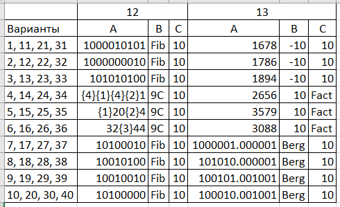

# Информатика(Академ. разница)

1. Сделать лабораторные 1,2 и 4 из [Методички](https://books.ifmo.ru/file/pdf/2464.pdf) (5 вариант везде)

2. [Лабораторная работа по регулярным выражениям](ITMO_INFO_PYTHON_TASK.pdf)(5 вариант)

3. Драфт

https://niuitmo-my.sharepoint.com/personal/312779_niuitmo_ru/_layouts/15/onedrive.aspx?id=%2Fpersonal%2F312779_niuitmo_ru%2FDocuments%2FУчебка%2Fхранение%20и%20обработка%20данных&originalPath=aHR0cHM6Ly9uaXVpdG1vLW15LnNoYXJlcG9pbnQuY29tLzpmOi9nL3BlcnNvbmFsLzMxMjc3OV9uaXVpdG1vX3J1L0VtSzJiTG5BRzZaQWdJVWNaenB2UVEwQmZ0T1I3dmJROFllYV9CZ1Y4SVpvVUE_cnRpbWU9ejExMEJuc0syVWc
